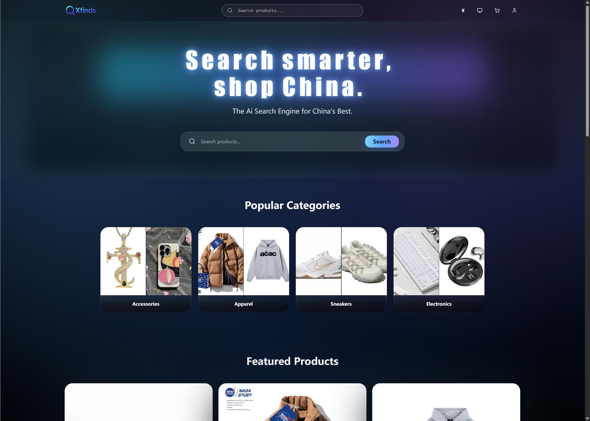
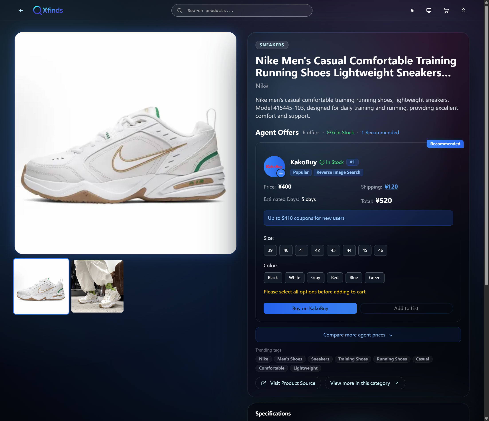
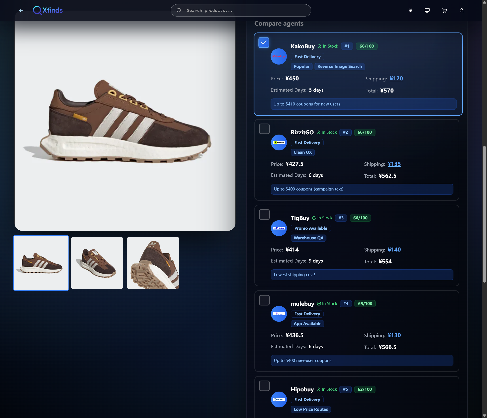

<div align="center">


# Xfinds

**Open-source shopping agent aggregator for smarter cross-border purchases**

A modern product search and agent comparison platform with a premium glassmorphic UI.  
Compare prices across multiple shopping agents, find the best deals, and streamline your purchasing workflow.

[](https://nextjs.org/)
[](https://www.typescriptlang.org/)
[](https://tailwindcss.com/)
[](LICENSE)

[**Live Demo**](https://xfinds.cc) · [**Documentation**](docs/ARCHITECTURE.md) · [**Report Bug**](https://github.com/TheNewMikeMusic/Xfinds/issues) · [**Request Feature**](https://github.com/TheNewMikeMusic/Xfinds/issues)

<br />



</div>

---

## Overview

Xfinds is an open-source platform that aggregates product listings from multiple shopping agents, enabling users to compare prices, shipping costs, and service quality in one unified interface. Built for transparency, speed, and extensibility.

### Key Features

- **Unified Search** — Search once, see offers from all agents in one view
- **Price Comparison** — Side-by-side comparison with real-time currency conversion
- **Smart Filters** — Filter by category, price range, agent, and more
- **Batch Checkout** — Save picks and open multiple agent links at once
- **Multi-language** — English and Chinese support out of the box
- **Dark Theme** — Premium glassmorphic UI with smooth animations
- **Self-hostable** — MIT licensed, API-friendly, easy to deploy

## Screenshots

<div align="center">
  
  <br /><br />
  
  <br /><br />
  
  <br /><br />
  
</div>

## Quick Start

### Prerequisites

- Node.js 18.0 or higher
- npm 9.0 or higher

### Installation

```bash
# Clone the repository
git clone https://github.com/TheNewMikeMusic/Xfinds.git
cd Xfinds

# Install dependencies
npm install

# Set up environment variables
cp .env.example .env.local

# Start development server
npm run dev
```

Open [http://localhost:3000](http://localhost:3000) in your browser.

### Production Build

```bash
npm run build
npm run start   # Runs on http://localhost:8000
```

## Tech Stack

| Category | Technologies |
|----------|-------------|
| Framework | Next.js 14 (App Router) |
| Language | TypeScript |
| Styling | Tailwind CSS, shadcn/ui |
| Animation | Framer Motion |
| State | Zustand |
| Search | Fuse.js |
| Auth | JWT (jose), bcryptjs |
| i18n | next-intl |
| Testing | Vitest, Playwright |

## Project Structure

```
xfinds/
├── app/              # Next.js App Router (pages & API routes)
├── components/       # React components
│   ├── ui/          # Base UI components (shadcn/ui)
│   ├── shared/      # Shared components
│   └── ...          # Feature-specific components
├── lib/             # Utility functions
├── store/           # Zustand state stores
├── data/            # JSON data files
├── messages/        # i18n translations (en, zh)
├── public/          # Static assets
├── scripts/         # Build and utility scripts
├── tests/           # Unit and E2E tests
└── docs/            # Documentation
```

## Documentation

- [Architecture Overview](docs/ARCHITECTURE.md) — System design and data flow
- [Deployment Guide](docs/DEPLOYMENT.md) — Production deployment instructions
- [Contributing Guide](CONTRIBUTING.md) — How to contribute
- [Changelog](CHANGELOG.md) — Version history

## Contributing

Contributions are welcome! Please read our [Contributing Guide](CONTRIBUTING.md) before submitting a Pull Request.

1. Fork the repository
2. Create your feature branch (`git checkout -b feature/amazing-feature`)
3. Commit your changes (`git commit -m 'feat: add amazing feature'`)
4. Push to the branch (`git push origin feature/amazing-feature`)
5. Open a Pull Request

## Roadmap

- [ ] Add more shopping agents
- [ ] Price history tracking
- [ ] Browser extension
- [ ] Mobile app (React Native)
- [ ] API for third-party integrations

## License

This project is licensed under the MIT License — see the [LICENSE](LICENSE) file for details.

## Acknowledgments

- [Next.js](https://nextjs.org/) — The React framework
- [shadcn/ui](https://ui.shadcn.com/) — Beautiful UI components
- [Tailwind CSS](https://tailwindcss.com/) — Utility-first CSS
- [Framer Motion](https://www.framer.com/motion/) — Animation library

---

<div align="center">

**[Website](https://xfinds.cc)** · **[GitHub](https://github.com/TheNewMikeMusic/Xfinds)** · **[Issues](https://github.com/TheNewMikeMusic/Xfinds/issues)**

Made with ❤️ by the Xfinds team

</div>
